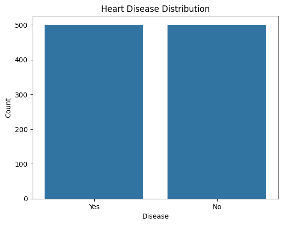
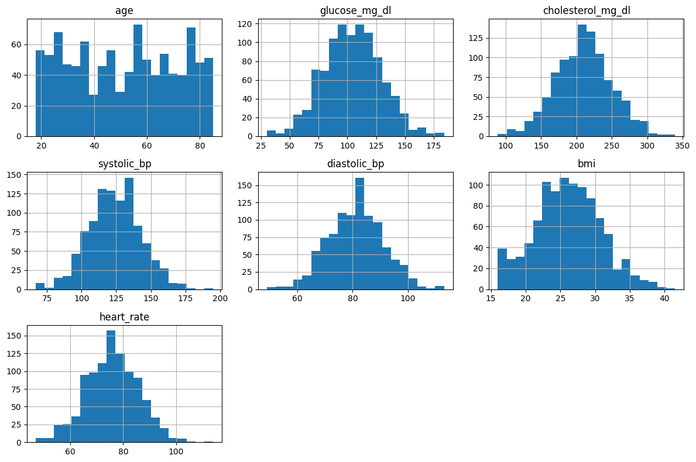
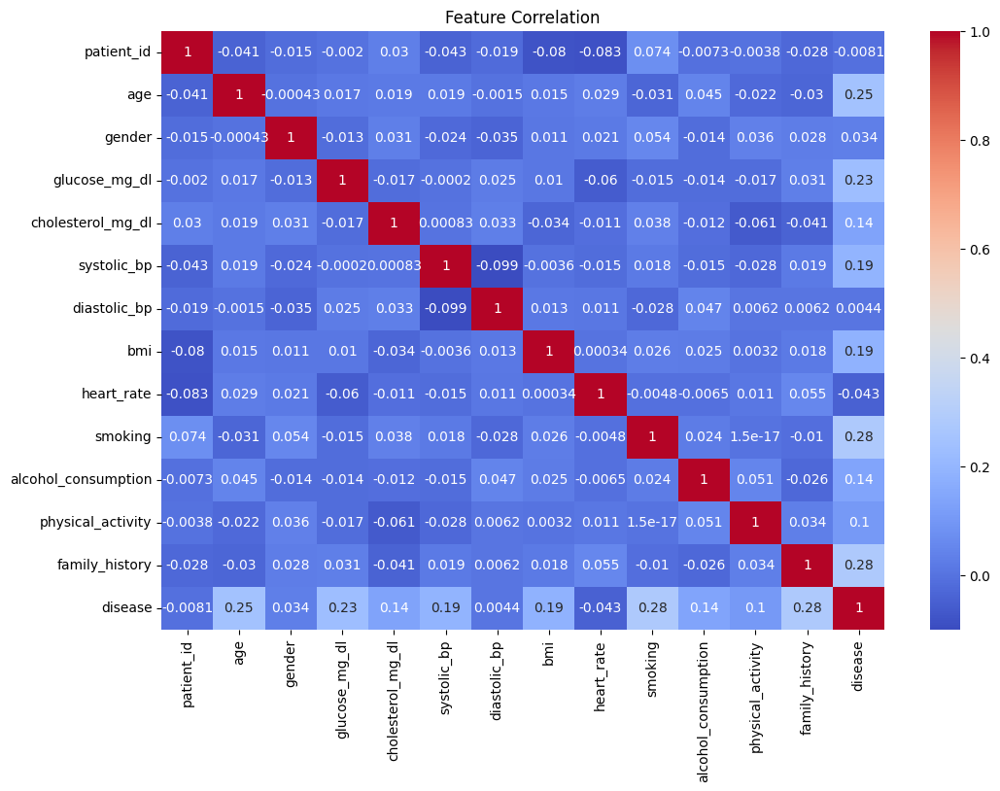
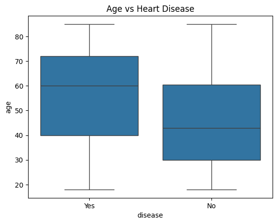
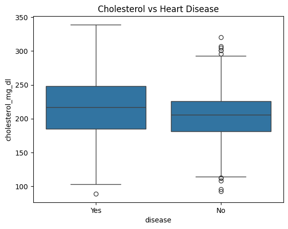
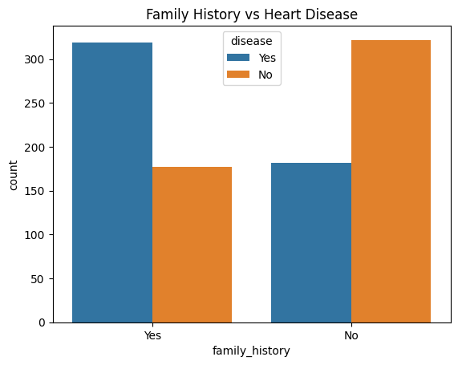
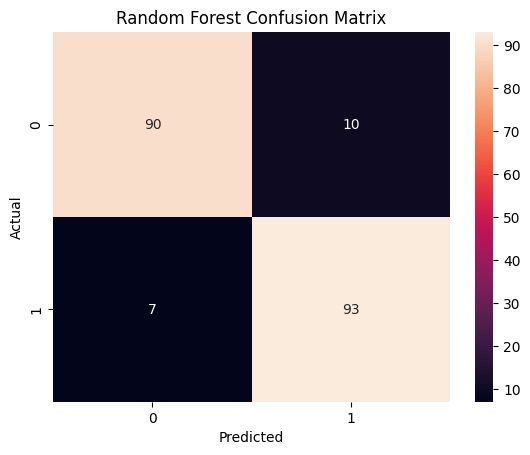
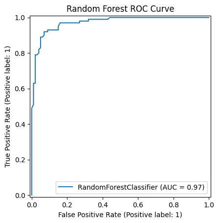
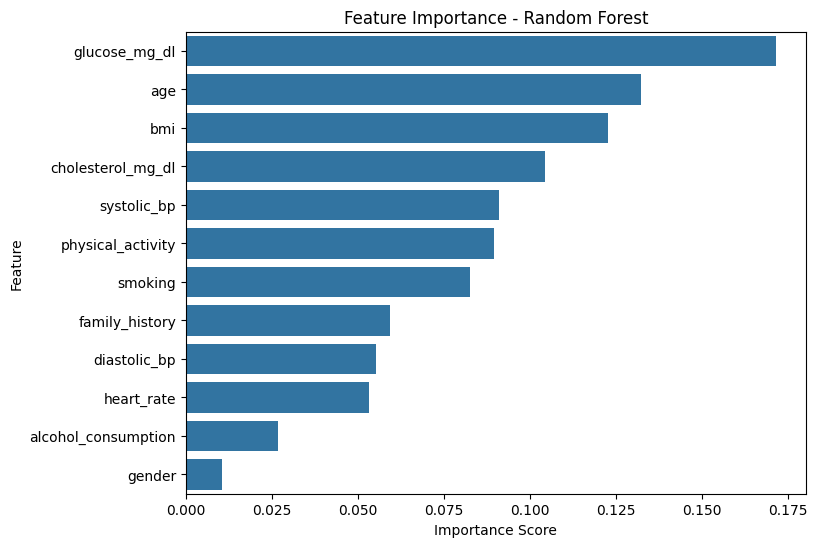

# ❤️ Heart Disease Prediction Using Machine Learning

## 👨‍💻 Author

**Kenneth Christian Nathanael**  
https://kenchristn.com | Data Analyst & AI Automation Enthusiast

GitHub: https://github.com/kenchristn

## 📌 Project Overview

This project builds a machine learning classification model to predict whether a patient has heart disease based on clinical and lifestyle indicators.

The objective of this project is to identify patterns related to heart disease and compare multiple machine learning models to determine which model performs best.

This notebook follows a complete machine learning workflow from data exploration to model interpretation.

---

## 🎯 Objectives

The main objectives of this project are:

- Predict whether a patient has heart disease
- Identify the most important contributing factors
- Compare multiple classification models
- Optimize the best-performing model
- Interpret prediction results using feature importance

Key questions explored in this project:

- Which features are most associated with heart disease?
- Which machine learning model performs best?
- Which variables contribute the most to prediction?

---

## 📂 Dataset

**Source:** Kaggle – Heart Disease Prediction Dataset

The dataset contains **1,000 patient records** and multiple clinical and lifestyle indicators.

### Features included:

| Feature | Description |
|---|---|
| age | Patient age |
| gender | Male / Female |
| glucose_mg_dl | Glucose level |
| cholesterol_mg_dl | Cholesterol level |
| systolic_bp | Systolic blood pressure |
| diastolic_bp | Diastolic blood pressure |
| bmi | Body mass index |
| heart_rate | Heart rate |
| smoking | Smoking habit |
| alcohol_consumption | Alcohol consumption |
| physical_activity | Physical activity level |
| family_history | Family history of heart disease |

### Target variable

**disease**

- **Yes** → patient has heart disease
- **No** → patient does not have heart disease

---

## 🛠️ Tools & Libraries

This project was developed using:

### Programming
- Python

### Libraries
- Pandas
- NumPy
- Matplotlib
- Seaborn
- Scikit-learn

### Environment
- Google Colab

---

## 🔄 Project Workflow

This project follows seven structured stages:

### 1. Data Collection
- load dataset
- review columns
- identify target variable

### 2. Data Exploration
- check shape
- inspect data types
- summary statistics
- missing values
- duplicate rows

### 3. Exploratory Data Analysis
- target distribution
- numerical feature distribution
- correlation heatmap
- compare features against target

### 4. Data Preprocessing
- remove unnecessary columns
- encode categorical variables
- split features and target
- train-test split
- feature scaling

### 5. Model Training & Evaluation
- Logistic Regression
- Decision Tree
- Random Forest

### 6. Hyperparameter Tuning & Feature Importance
- GridSearchCV
- tuned model comparison
- feature importance analysis

### 7. Final Conclusion
- summarize model performance
- identify strongest predictors

---

## 📊 Exploratory Data Analysis

### Target Distribution

The dataset is balanced between patients with heart disease and without heart disease.



---

### Numerical Feature Distribution

Most numerical variables show relatively normal distribution patterns.



---

### Correlation Heatmap

The correlation heatmap shows weak to moderate relationships between several features and heart disease.

Features such as age, glucose level, smoking, and family history show stronger positive correlation compared with other variables.



---

### Feature Comparison Against Heart Disease

Age, cholesterol level, smoking, and family history show visible differences between patients with and without heart disease.







### Key EDA Findings

- target classes are balanced
- patients with heart disease tend to be older
- higher glucose is associated with heart disease
- cholesterol levels are slightly higher in positive cases
- smoking shows a clear relationship with the target
- family history contributes to prediction

---

## 🤖 Model Training & Evaluation

Three machine learning classification models were trained and evaluated.

### Models used

- Logistic Regression
- Decision Tree
- Random Forest

### Best-performing model

✅ **Random Forest**

### Performance Results

| Metric | Score |
|---|---:|
| Accuracy | 91.5% |
| Precision | 90.3% |
| Recall | 93.0% |
| F1 Score | 91.6% |
| ROC AUC | 0.97 |

The Random Forest model produced the highest overall performance and balanced prediction results.

---

### Confusion Matrix

The model correctly classified most observations while keeping false predictions low.

- True Negative: 90
- False Positive: 10
- False Negative: 7
- True Positive: 93



---

### ROC Curve

The ROC Curve shows strong classification performance with an AUC of **0.97**.



---

## ⚙️ Hyperparameter Tuning

Random Forest was optimized using **GridSearchCV**.

### Best parameters

```python
{
    "n_estimators": 200,
    "max_depth": None,
    "min_samples_split": 2,
    "min_samples_leaf": 1
}
```

### Result

The tuned model produced the same performance as the baseline model.

This confirms that the original Random Forest configuration was already well optimized for this dataset.

---

## 📈 Feature Importance

Feature importance helps interpret the model and identify the strongest predictors.

### Top predictors

| Rank | Feature |
|---:|---|
| 1 | Glucose level |
| 2 | Age |
| 3 | BMI |
| 4 | Cholesterol |
| 5 | Systolic blood pressure |

Lifestyle-related variables such as smoking and physical activity also contributed to prediction.



---

## ✅ Final Conclusion

This project successfully developed a machine learning model to predict heart disease using patient clinical and lifestyle indicators.

### Final results

- Random Forest achieved the best performance
- accuracy reached **91.5%**
- recall reached **93.0%**
- AUC reached **0.97**

### Most important predictors

- glucose level
- age
- BMI
- cholesterol
- systolic blood pressure

### Summary

This project demonstrates a complete machine learning workflow:

✅ data exploration  
✅ exploratory data analysis  
✅ preprocessing  
✅ model training  
✅ evaluation  
✅ hyperparameter tuning  
✅ model interpretation

The final model shows strong potential for predicting heart disease and provides useful insight into important contributing factors.

---

## 📁 Repository Structure

```bash
heart-disease-prediction-ml/
│
├── visuals/
├── disease_prediction.csv
├── heart_disease_prediction.ipynb
├── README.md
├── LICENSE
└── .gitignore
```
